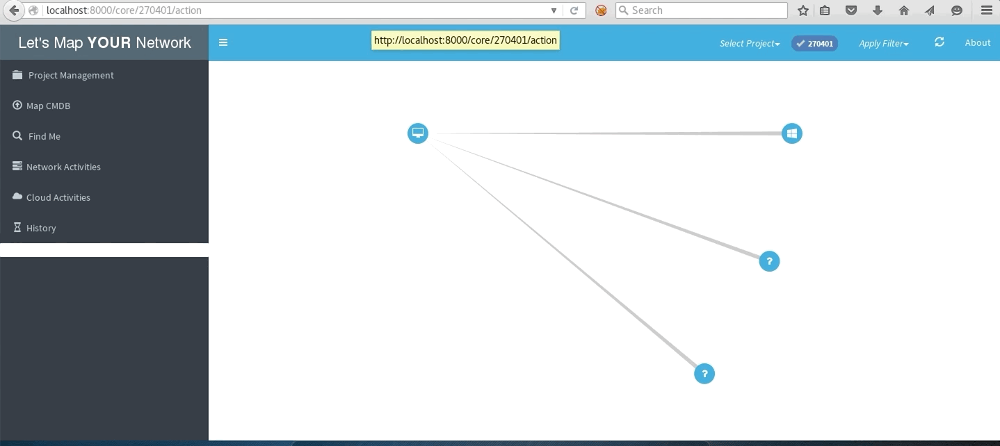

## LET’S MAP [YOUR] NETWORK ##

### Table of Contents
1. [WHAT IT IS](#what-it-is)
2. [WHY IT IS](#why-it-is)
3. [WHERE TO USE IT](#where-to-use-it)
4. [Presentations](#presentations)
5. [Key Features](#key-features)
6. [Installation Guidelines](#installation-guidelines)
7. [HOW TO USE IT](#how-to-use-it) 
8. [Contributer](#contributer)
9. [LMYN In Action](#lmyn-in-action)

### WHAT IT IS ###

It is utmost important for any security engineer to understand their network first before securing it and it becomes a daunting task to have a ‘true’ understanding of a widespread network. In a mid to large level organisation’s network having a network architecture diagram doesn’t provide the complete understanding and manual verification is a nightmare. Hence in order to secure entire network it is important to have a complete picture of all the systems which are connected to your network, irrespective of their type, function, techology etc.

##### BOTTOM LINE - YOU CAN'T SECURE WHAT YOU ARE NOT AWARE OF. #####

Let’s Map Your Network (LMYN) aims to provide an easy to use interface to security engineer and network administrator to have their network in graphical form with zero manual error, where a node represents a system and relationship between nodes represent the connection.

LMYN does it in two phases:
1. Learning: In this phase LMYN 'learns' the network by performing the network commands and quering the APIs and then builds graph database leveraging the responses. User can perform any of the learning activities at any point of time and LMYN will incorporate the results in existing database.
2. Monitoring: This is a continuos process, where LMYN monitors the 'in-scope' network for any changes, compare it with existing information and update the graph database accordingly.

Below technologies have been used in the tool:
1. Django Python
2. Neo4j DB
3. Sigma JS
4. Celery and RabbitMQ

### WHY IT IS ###
 - Visualizing infrastructure network in form of graph makes it more ‘visible’ and it becomes significantly easy to perform the analysis and identify the key areas of concern for a security engineer and network administrator
 - Also, Let’s Map Your Network formulates the graph entirely based-on either network actions performed from ‘seed’ system which will be part of the actual network or quering the APIs. Hence there is no chance of manual-error in the mapping of network
 
### WHERE TO USE IT ###
1. Network Architecture 'Validation'
2. Troubleshooting for network administrator
3. Internal Network vulnerability assessment and penetration testing

### Presentations ###
 - [BlackHatEurope2018 presentation slide](docs/LetsMapYourNetwork_BlackHat.pdf)
 - [Demo Videos](https://www.youtube.com/channel/UC77eNGlIzjGL0fgx3i6Hcyw)

### [Key Features](KeyFeatures.md)

### [Installation Guidelines](InstallationGuidelines.md)

### [HOW TO USE IT](HowTo.md) 

### Contributer ###
[Jyoti Raval](https://www.linkedin.com/in/jyoti-raval-61565157/): (Brutal!) QA

### LMYN In Action

#### Local subnet network

#### Network with traceroute to mulitple destinations

#### Cloud network

Shoot any suggestion/complain/bug to varchashva \[at] gmail \[dot] com
