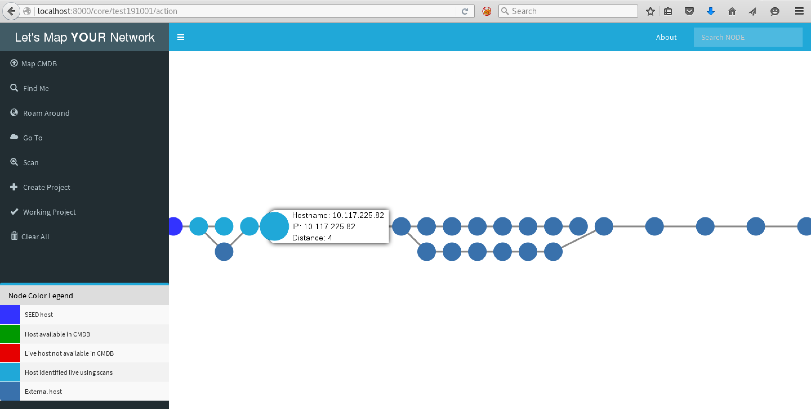

## LET’S MAP [YOUR] NETWORK ##

#### WHAT IT IS #### 

It is utmost important for any security engineer to understand their network first before securing it and it becomes a daunting task to have a ‘true’ understanding of a widespread network. In a mid to large level organisation’s network having a network architecture diagram doesn’t provide the complete understanding and manual verification is a nightmare. Hence in order to secure entire network it is important to have a complete picture of all the systems which are connected to your network.

##### BOTTOM LINE - YOU CAN'T SECURE WHAT YOU ARE NOT AWARE OF. #####

Let’s Map Your Network (LMYN) aims to provide an easy to use interface to security engineer and network administrator to have their network in graphical form with zero manual error, where a node represents a system and relationship between nodes represent the connection. To achieve this it uses the basic network commands such as traceroute, ping scan etc.

Below are the modules in LMYN to perform the task of mapping

1. Project Management – Two modules (New Project and Working Project) will allow you to create and switch between the different projects
2. Load CMDB - This module allows an administrator to upload the CMDB file (new line seperated) and map it entirely. Additionaly, it have a Be Intrusive feature which, if selected, will perform enumeration to identify the 'rogue' host that are not present in CMDB. RED color node will depicts the rogue nodes
3. Find Me – This module enumerates the IP of system in which it is running and further network mapping will be done considering the current system as a 'seed'
4. Roam Around – This module identifies all ‘live’ hosts in the same LAN in which seed system is connected
5. Go To – This module displays graph of all hops that packet is traversing through to reach destination (provided by user) from seed system
6. Scan – This module will perform ping scan of any arbitrary IP range provided by user

Below technologies have been used in the tool:
1. Django Python
2. Neo4j DB
3. Sigma JS

#### WHY IT IS #### 
 - Visualizing infrastructure network in form of graph makes it more ‘visible’ and it becomes significantly easy to perform the analysis and identify the key areas of concern for a security engineer and network administrator
 - Also, Let’s Map Your Network formulates the graph entirely based-on the network actions performed from ‘seed’ system which will be part of the actual network. Hence there is no chance of manual-error in the mapping of network
 
#### WHERE TO USE IT #### 
1. Network Architecture 'Validation'
2. Troubleshooting for network administrator
3. Internal Network VAPT     

## INSTALLATION GUIDELINES ##

#### TL;DR (use shortcut: docker installation - Linux)####

1. Install [docker](https://docs.docker.com/install/linux/docker-ce/debian/#install-using-the-repository)
   - sudo apt-get update
   - sudo apt-get install docker-ce
   - sudo docker run hello-world
2. git clone https://github.com/varchashva/LetsMapYourNetwork.git
3. cd LetsMapYourNetwork
4. sudo docker-compose build
5. sudo docker-compose up
6. Browse to http://localhost:9999/core and you are set to explore the tool :)

### Long version ###
#### For Linux User (Note - Below commands have been provided for Debian-based linux. For other versions of Linux change all commands accordingly) #### 

1. Download LMYN from GitHub and extract all to a directory like /opt/LMYN ($LMYN_HOME)
2. Install python: sudo apt-get install python2.7
3. Install nmap: sudo apt-get install nmap 
4. Install Java Development Kit
   - Install Oracle JDK 8 (it’s a prerequisite for Neo4j database)
   - Run command java -version on terminal
   - If output with version details then jump to Neo4j installation or else continue with Java installation 
   - Run below commands to install Java
     - sudo add-apt-repository ppa:webupd8team/java -y
     - sudo apt-get update 
     - sudo apt-get install oracle-java8-installer
5. Go to Neo4j [download](https://neo4j.com/download-center/#releases) section
   - Select ‘Community Server’ section and [download Linux version of Neo4j](https://go.neo4j.com/download-thanks.html?edition=community&release=3.3.6&flavour=unix&_ga=2.217214878.946316120.1534600164-1297405808.1534400604)
   - Extract the downloaded file with command sudo tar -xzf neo4j-community-3.3.6-unix.tar.gz -C /opt/neo4j
   - Change to neo4j directory cd /opt/neo4j
   - Run command ./bin/neo4j console to start the neo4j server
   - Browse to Neo4j web console (http://localhost:7474) to change the default password from neo4j to Neo4j
   - Please refer [Neo4j Installation Guide](https://neo4j.com/docs/operations-manual/current/installation) for any troubleshooting, if required 
6. Run command sudo pip install --trusted-host pypi.python.org -r $LMYN/LetsMapYourNetwork/requirements.txt
7. Run command sudo python $LMYN_HOME/LetsMapYourNetwork/manage.py runserver 0.0.0.0:9999 --insecure
8. Open http://localhost:9999/core in browser and explore the tool

#### For Windows User #### 

1. Download LMYN from GitHub and extract all. It is recommended to extract within Python home directory for e.g. C:\python\LMYN ($LMYN_HOME)
2. Install python 
   - Go to python [download](https://www.python.org/downloads/release/python-2715) section and click on [Windows x86 MSI installer for 32-bit](https://www.python.org/ftp/python/2.7.15/python-2.7.15.msi) user OR [Windows x86-64 MSI installer](https://www.python.org/ftp/python/2.7.15/python-2.7.15.amd64.msi) for 64-bit user 
   - Install the downloaded python file with all default settings
3. Download [nmap](https://nmap.org/dist/nmap-7.70-setup.exe) from here and install with all default settings
4. Install Microsoft Visual Studio C++
   - 32-bit user install [VC setup](http://download.microsoft.com/download/A/5/4/A54BADB6-9C3F-478D-8657-93B3FC9FE62D/vcsetup.exe) only with all optional product UNCHECKED
   - 64-bit users install [Windows SDK and .NET Framework](https://www.microsoft.com/en-us/Download/confirmation.aspx?id=8442) with default settings  
5. Install Oracle JDK 8 (it’s a prerequisite for Neo4j database)
   - Run command java -version on command prompt
   - If output with version details then jump to Neo4j installation or else continue with Java installation 
   - Go to Oracle [download](http://www.oracle.com/technetwork/java/javase/downloads/jdk8-downloads-2133151.html) section and install JDK 8 with all default settings
   - Go to JRE installation directory like C:/Program files/java/jre7/bin and create a folder ‘server’ and copy all content of folder ‘client’ to folder ‘server’
6. Go to Neo4j [download](https://neo4j.com/download-center/#releases) section
   - Select ‘Community Server’ section and [download Windows version](https://go.neo4j.com/download-thanks.html?edition=community&release=3.4.6&flavour=winzip&_ga=2.141706682.946316120.1534600164-1297405808.1534400604)
   - Right click on downloaded file and click extract all to a directory like C:\neo4j
   - Open the command prompt with administrative privileges and change to extracted directory like cd C:\neo4j 
   - Run command bin\neo4j console to start the neo4j server
   - Browse to Neo4j web console (http://localhost:7474) to change the default password from neo4j to Neo4j
   - Please refer [Neo4j Installation Guide](https://neo4j.com/docs/operations-manual/current/installation/) for any troubleshooting, if required 
7. Open command prompt with Administrative privilegs and browse to Python home directory for e.g. cd C:\python
   - Run command python -m pip install --trusted-host pypi.python.org -r $LMYN/LetsMapYourNetwork/requirements.txt
8. Use same command prompt with Administrative privileges and from Python home directory
   - Run command python $LMYN_HOME\LetsMapYourNetwork\manage.py runserver 0.0.0.0:9999 --insecure
9. Open http://localhost:9999/core in browser and explore the tool

### HOW TO USE IT ###
1. First you need to connect your system into the target network (this will provide us the seed system)
2. Now you can create a dedicated project using New Project module or else you may choose to continue with default project
3. You can perform different network action such as
   - traceroute to different location system to identify the connection path
   - Discover all hosts in seed system’s Local LAN
   - Discover all hosts in a particular subnet range 
   - More action you perform, more visibility you get about the network 

#### FUTURE TO-DO #### 
1. More interactive actions for node 
2. Provide solution as Docker installation
3. Grouping of systems – like same subnet IPs as one group
4. System fingerprinting
5. Geographical location mapping

Shoot any suggestion/complain/bug to varchashva \[at] gmail \[dot] com